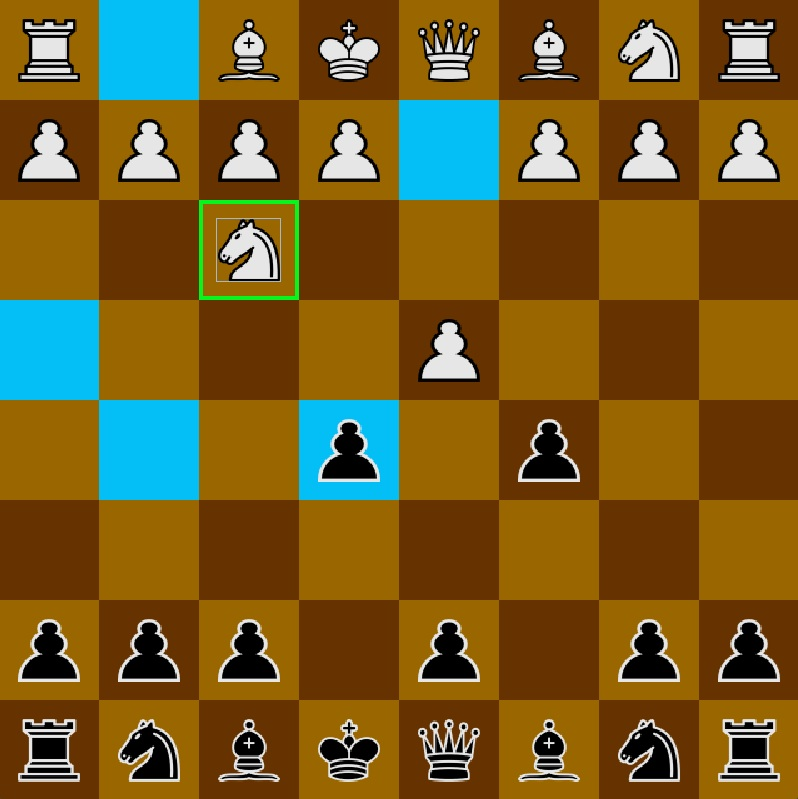
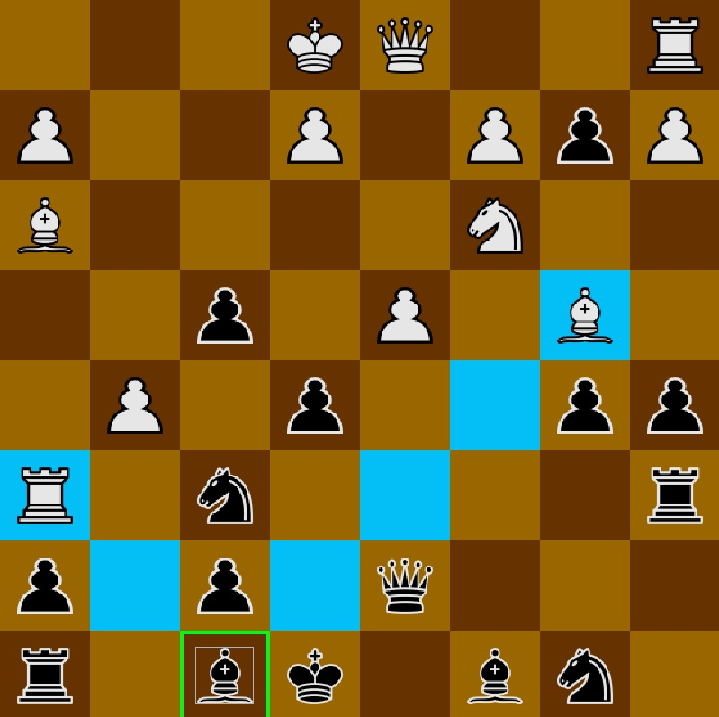

# Chess Game

---
**Description**

A simple chess game that allows two players to compete over a TCP network. It uses a client-server architecture for communication.

---
**How It Works**

One player starts the game by running the server (ServerListener). They then connect to it using a client. The game waits for a second player to connect.

Once the second player joins using their own client, the game starts. Moves are exchanged over a TCP connection, ensuring reliable communication between both players.

---
**Selecting a piece will show the available moves.**

---

---

---